# Survivor

## Docker Automatic Install

```sh
cp .env.example .env
docker compose up --build
```

## Manual Install

```sh
cp .env.example .env
```

1. Install Front

    ```sh
    npm install
    ```

1. Install Back

    ```sh
    python -m venv .venv
    ```

1. Setup Environment

    ```sh
    cp .env.example .env
    ```

1. Run Front App

    ```sh
    npm run next-dev
    ```

1. Run Back App

    ```sh
    source .venv/bin/activate
    npm run fastapi-dev
    ```

## Preview

### Login

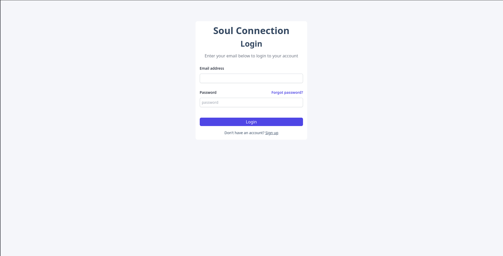

### Dashboard

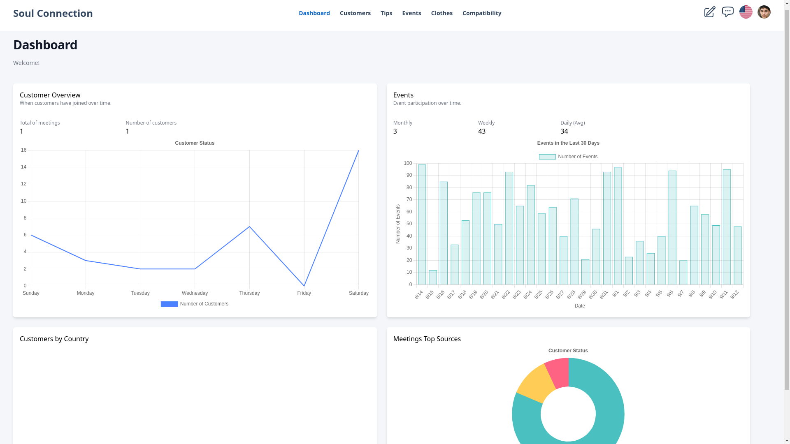

### Tips

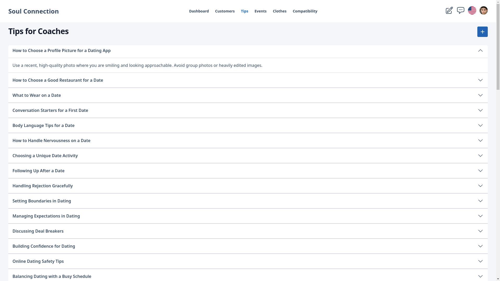

### Events

Events
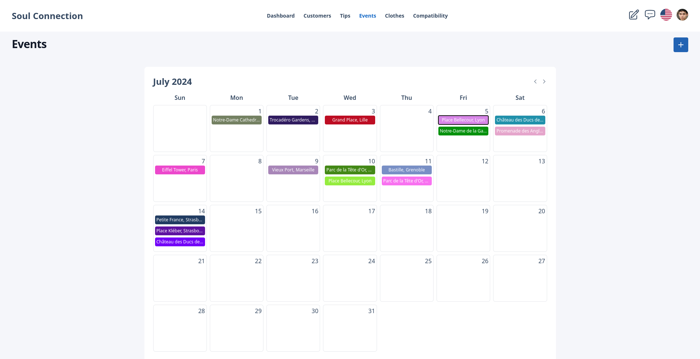
Maps
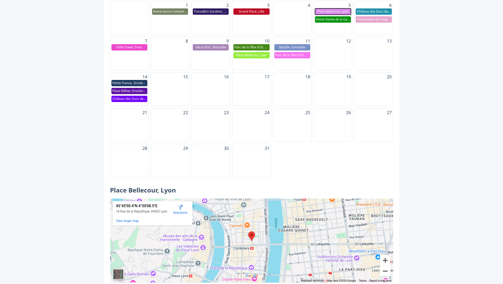

### Coach

List
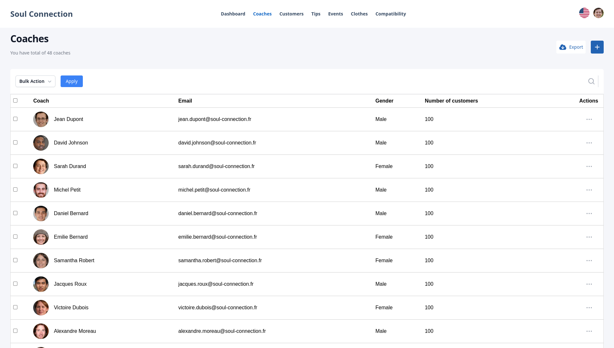
Profile


### Customer

List
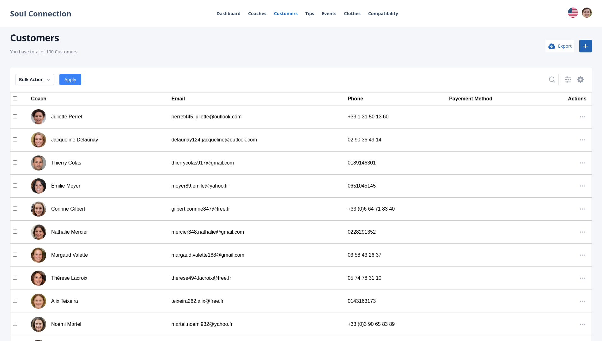
Profile
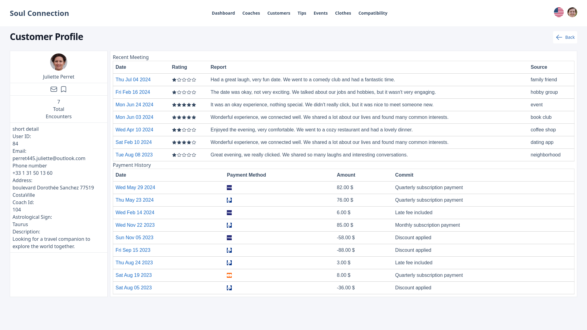

### Clothes

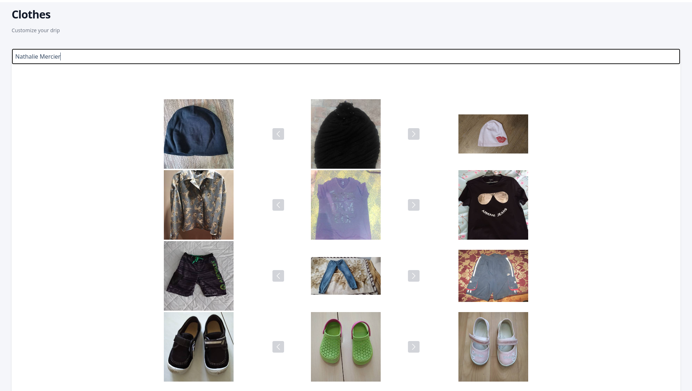

### Compatibility

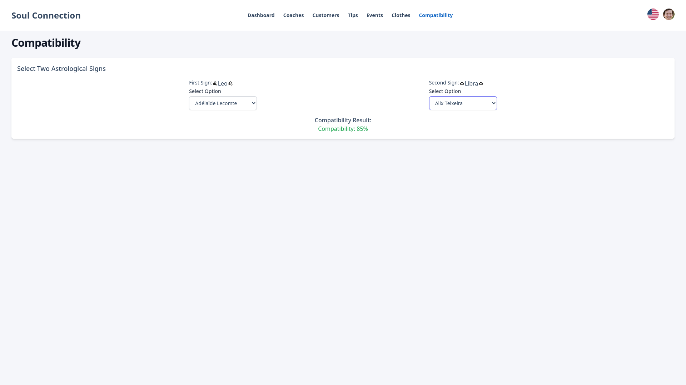

### Chat

Selection
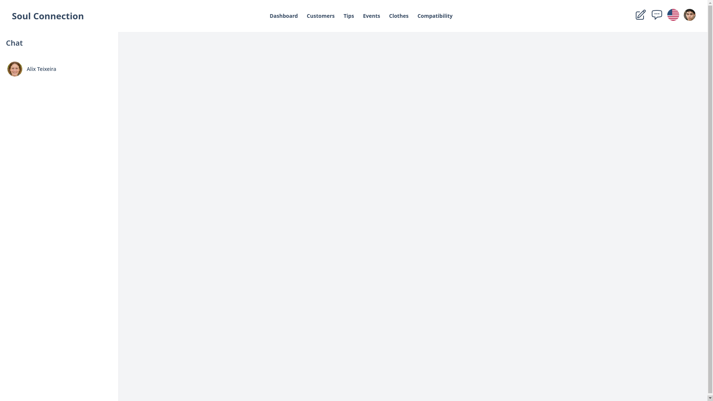

Conversation
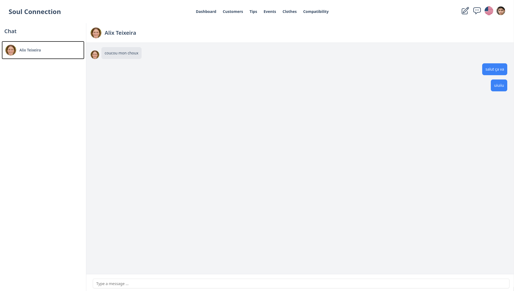

### note

Selection
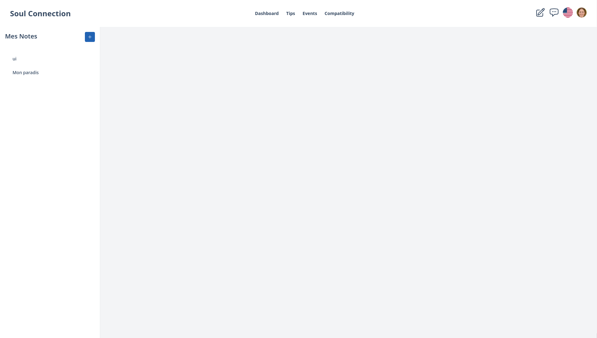

Conversation
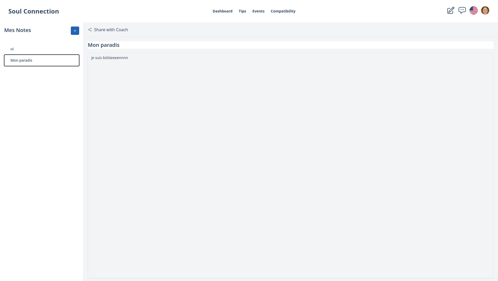
